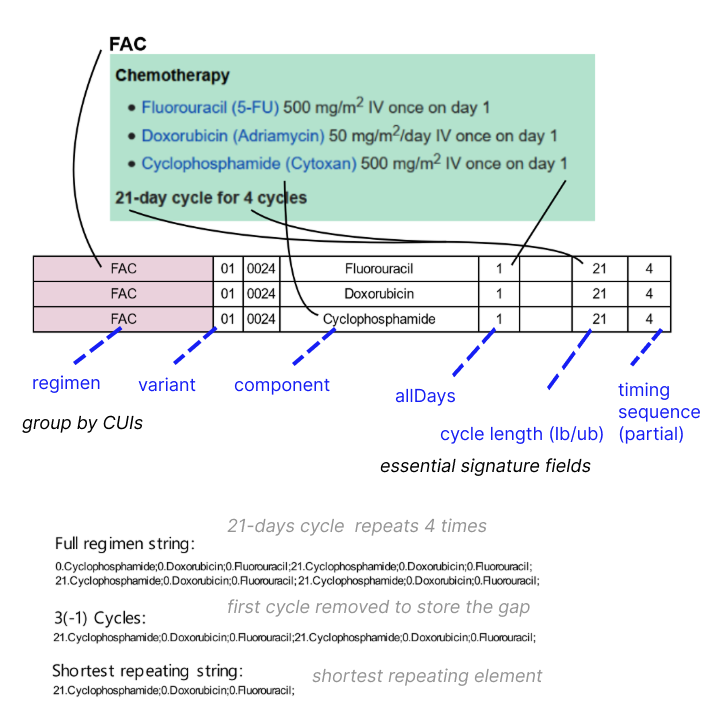

# Regimen Assembler Pipeline  (Steps 1–5)


## Section Step 1 – Vocabularies Preprocessing

This step loads the core raw HemOnc input table — `sigs`. Additional information is derived from a Postgres mirror of the Athena database, which stratifies data using standardized vocabularies and provides OMOP-compatible ontology. Output of this preprocessing step:

- `sigs_with_conditions.tsv`   

In the context of condition expansion, records are exploded — meaning one input row may become many.

Additionally, a **modular blacklist system** is applied to remove irrelevant or noise entries early in the pipeline. This is JSON-based, easy to expand, and helps filter invalid terms by rule or pattern.

>💡 Handlers are explained in the sections below

The modular blacklist system is expanded into its own section describing handlers, reporters, and resolver classes. The components form a pipeline that seamlessly pre-processes and tracks idiosyncrasies to minimise regression errors. The reporting system runs as a side effect during the initial pipeline steps. Output of this preprocessing step:

- `reports.xlsx`  


## Section Step 2 – Transformation & Regimens Assembly
  
This step applies logic for **regimen strings** creation, which represent ordered combinations of treatment components over time. The core implementation is **Shortest Repeating Element (SRE)**.

### SRE Module 

_Class: `SREModule`_  
_Module `sre_impl`_

The **SRE module** is responsible for translating raw treatment data into ordered, time-aware **regimen strings**. It is designed with an intent to capture both continuous and cyclical regimen forms. The formatting process leads to creation "short string" which is regimen data stored as alignment-ready representation object.

```
💡 Each regimen’s SRE may be defined as the smallest possible set of transition times and exposures that are sufficient, when repeated, to reconstruct a regimen entirely.

Format:
Time gap1.Drug component1; Time gap2.Drug component2; Time gap3.Drug component3;
```

#### Group Processing Logic



Grouping is based on:
* CUI keys for condition, regimen and variant

These fields define unique sub-cohorts to process. Within each group, the following fields are used to build component timelines:

* essential signature fields table

| Field                    | Source     | Type          | Usage                                                                                  |
|--------------------------|------------|---------------|----------------------------------------------------------------------------------------|
| `component`              | CUI        | string        | Defines the drug or intervention name. Each is independently vectorized.              |
| `timing_sequence`        | Signature  | string        | Indicates which regimen cycles this component is active in (e.g., `"1,3,4"`). Used to align vectors and collapse events. |
| `allDays`                | Signature  | string        | Raw days of administration within a cycle (e.g., `"1, 8"`). Parsed into integer day offsets using `get_idays()`. |
| `cycle_length_lb` / `cycle_length_ub` | Signature  | string / float | Lower and upper bounds of cycle duration. Parsed and converted into timeline vector length using `convert_to_days()`. |
| `cycle_length_unit`      | Signature  | string        | The time unit (`"day"`, `"week"`, `"month"`, `"indeterminate"`, etc.). Drives conversion to vector length in days. |


Note: The pipeline assumes a consistent unit and structure within each group. Mixed values or indeterminate cases are patched or logged.


>💡 Process summary: 

A CUI group is first selected, and for each component within it, a binary vector is built from essential signature fields to represent days of drug activity within a cycle (1 for active, 0 for inactive). These vectors are then aligned across all relevant cycles to form a full event matrix. The matrix is scanned chronologically, and each day with activity is encoded into a structured string (the regimen string), capturing the timing and order of events across components.

#### 1. Component Vector Construction

_Function: `build_component_vector(idays, csig)`_

_Properties:_  
_`idays` : parsed from "allDays" using regex._  
_`csig` computed sig from "cycle\_length\_*" using convert_to_days()._

Each component in a group is individually transformed into a binary vector that represents when the drug is administered across a fixed-length cycle. Output is a binary 1D NumPy array: `[1, 0, 0, 0, 1, ...]`. Multiple vectors may be created per drug if both "cycle_length_lb" and "cycle_length_ub" are defined and differ. Each distinct vector is treated as a variant of that component. The vectors are grouped by "timing_sequence", meaning they are mapped to the regimen cycles where they're active. This mapping forms the basis for multi-cycle alignment and collapsing.

#### 2. Event Matrix Collapse

_Function:_   
`collapse_event_matrix_wrapper`   
`collapse_event_matrix`

For the event-matrix collapse encoding, the invariant is: the sum of all emitted time-deltas equals the total timeline length $N$ - i.e. the number of days in the full long vector spanning all cycles.

During vectors block placement:

* Validates vector lengths and presence of multiple variants.
* Pads all vectors to the same length across components and cycles.
* Constructs a unified "event matrix" (1 if any drug is active on a day).

Then scans the timeline and for each active day, captures:

* The day-to-day gap from previous event (delta)
* The main and co-active drugs to order alphabetically.
* Encodes entries in the format: "delta.DrugName" (e.g., "7.Gemcitabine;0.Paclitaxel").
* The first-poistion delta is calculated as 
$$ \delta_0 = (n_{\text{cycles}} \cdot \text{days}) \;-\; \sum_{x=1}^{k} \delta_x $$
k - number of subsequent events using 0-based indexing
* Duplicates the string if only one component is present (min-2-token rule).

Final output is a semicolon-separated regimen string.
____
#### Example 1

| component | timing sequence | cycle length | unit | allDays |
| --------- | --------------- | ------------ | ---- | ------- |
| F         | 1,2,3,4         | 21           | day  | 1       |
| D         | 1,2,3,4         | 21           | day  | 1       |
| C         | 1,2,3,4         | 21           | day  | 1       |


Vectors:

Component F → [1, 0, 0, 0, 0, 0, 0, 0, 0, 0, 0, 0, 0, 0, 0, 0, 0, 0, 0, 0, 0]  
Component D → [1, 0, 0, 0, 0, 0, 0, 0, 0, 0, 0, 0, 0, 0, 0, 0, 0, 0, 0, 0, 0]  
Component C → [1, 0, 0, 0, 0, 0, 0, 0, 0, 0, 0, 0, 0, 0, 0, 0, 0, 0, 0, 0, 0]


```
Cycle:        |   1   |   2   |   3   |   4   |
Day Index:    | 0–20  |21–41  |42–62  |63–83  |

Matrix:       | C,D,F | | | | | | | | | | | | | | | | | | | | |
              | C,D,F | | | | | | | | | | | | | | | | | | | | |
              | C,D,F | | | | | | | | | | | | | | | | | | | | |
              | C,D,F | | | | | | | | | | | | | | | | | | | | |
```

The timeline is scanned from start to end. Every day with activity is marked:
| Day Index | Active Drugs | Tag            |
| --------- | ------------ | -------------- |
| 0         | C, D, F      | (84-63).C; 0.D; 0.F |
| 21        | C, D, F      | 21.C; 0.D; 0.F |
| 42        | C, D, F      | 21.C; 0.D; 0.F |
| 63        | C, D, F      | 21.C; 0.D; 0.F |


Resulting from above tagging (regString):
```
21.C; 0.D; 0.F; 21.C; 0.D; 0.F; 21.C; 0.D; 0.F; 21.C; 0.D; 0.F;
```

By identifying the shoretest repeating string (shortString):
```
→ 21.C; 0.D; 0.F;
```

#### Example 2

| component | timing sequence | cycle length | unit | allDays  |
| --------- | --------------- | ------------ | ---- | ---------- |
| A         | 1,3,5           | 21           | day  | 1, 2       |
| B         | 2,4             | 21           | day  | 1, 3       |
| C         | 2,4             | 21           | day  | 1, 4       |


Vectors:

Component
A → [1, 1, 0, 0, 0, 0, 0, 0, 0, 0, 0, 0, 0, 0, 0, 0, 0, 0, 0, 0, 0]

Component
B → [1, 0, 1, 0, 0, 0, 0, 0, 0, 0, 0, 0, 0, 0, 0, 0, 0, 0, 0, 0, 0]

Component
C → [1, 0, 0, 1, 0, 0, 0, 0, 0, 0, 0, 0, 0, 0, 0, 0, 0, 0, 0, 0, 0]

```
Cycle:        |  1  |  2  |  3  |  4  |  5  |

Day Index:    | 0–20 |21–41|42–62|63–83|84–104|

Matrix:       | A  | A  |        |        |        |  x16   |
              | B,C|    | B      | C      |        |  x16   |
              | A  | A  |        |        |        |  x16   |
              | B,C|    | B      | C      |        |  x16   |
              | A  | A  |        |        |        |  x16   |
```

The timeline is scanned from start to end. Every day with activity is marked:
| Day Index | Active Drugs | Tag                   |
| --------- | ------------ | --------------------- |
| 0         | A            | 20.A (105 (total length) - 85 (sum of deltas)) |
| 1         | A            | 1.A                   |
| 21        | B, C         | 20.B; 0.C             |
| 23        | B            | 2.B                   |
| 24        | C            | 1.C                   |
| 42        | A            | 18.A                  |
| 43        | A            | 1.A                   |
| 63        | B, C         | 20.B; 0.C             |
| 65        | B            | 2.B                   |
| 66        | C            | 1.C                   |
| 84        | A            | 18.A                  |
| 85        | A            | 1.A                   |


Resulting from above tagging (regString):
```
20.A; 1.A; 20.B; 0.C; 2.B; 1.C; 18.A; 1.A; 20.B; 0.C; 2.B; 1.C; 18.A; 1.A;
```

By identifying the shoretest repeating string (shortString):

```
→ unchanged
```

### Multiple Representation Handling (idiosyncrasies)

_Class types_
`Handlers`
`Tracker`
`Logger`
`Resolver`
`Preprocessor`

- NullValueHandlers  
  - removes groups where any grouping key is null and writes the dropped groups to a report.  
  - fills missing condition/condition_cui with "undefined", logs and reports affected regimens.  
  - detects variants where any essential signature field is null, reports them and drops entire affected variants.

- RegimenHandler  
  - Records counts and exports unique group metadata.  
  - Radiotherapy: detects, reports and drops radiotherapy-containing regimens (various RT tokens).
  - Imbalanced: finds and drops regimen groups where different variants have unequal numbers of components; reports component mismatches and writes per-variant component summaries.

- VariantHandler  
  - Partial variants: classifies variants as single- or multi-part, reports counts, and separates multi-part cases for resolution; writes reports for multi-part and single-part variants.

- PatternHandlers  
  - Logging indefinite cycles: flags groups with cycle_length_unit == "indeterminate" and logs counts.  
  - Days patterns: identifies and separates variants that contain unhandled patterns in allDays
    - negative indices 
    - ranges
    - optional markers  


- SupplementaryHandler  
  - Blacklist use: applies component-level blacklist, logs dropped components and removes whole variant groups that contain any blacklisted component.  
  - Blacklist use (regimen name): applies blacklist regexes against the regimen title and drops groups where the regimen matches forbidden patterns; reports dropped groups.  
  - Component role clean: removes variants that contain disallowed component roles (e.g., "secondary systemic", "locoregional"), reports per-role and aggregated drop statistics.

- AuditColumnTypes (audit)  
  - Samples input rows, infers types and writes a JSON schema and audit log.

- Tracker  
  - concatenates multiple subsets while logging overlaps between them (used to validate that dropped/kept splits are disjoint).  
  - verifies counts of variants across splits (standard vs funny/dropped), asserts conservation of variant counts, and logs summary stats.

- Reporter   
  - Centralized reporting: writes diagnostic TSVs during preprocessing and compiles them into an Excel workbook (reports.xlsx) using a sheets configuration. Adapts/group-stats and computes per-regimen status percentages.

- Resolver 
  - handles idiosyncracies
  - Resolving partial variants:
   takes multi-part variant frame groups and attempts to collapse/resolve duplicates within a component by comparing component_cui, timing_sequence and step_number. It keeps a single representative row per resolved component (drops exact duplicates or differing step variants according to heuristics), writes a 'resolved' report TSV and returns the cleaned frame.  


How they work together (orchestration)

- Preprocessor initializes these components and runs them in a staged pipeline: supplementary/blacklist and role filters → null/value audits and regimen-level filters (RT, imbalance) → split single vs multi-part variants → resolver fixes multi-part variants → pattern handlers validate allDays/timing formats → tracking and reporting produce TSV/XLSX diagnostics. The design favors conservative drops with reporting so problematic cases can be audited and iteratively patched.


### Outputs
- The primary output format:  `regimens.tsv` – a normalized, structured list of regimens with timing encoded
- Final result is a table with:
  - `regString`, `shortString`, `regimen_cui` (translated to regCode), `regimen` (translated to regName), etc.
- The final output regimens are deduplicated per unique short strings only, thus loss of group main keys is active 

Uses of case dependant additions:

- Other transformed columns (Legacy):
    `regCodeExt`,
    `conditionCode`,
    `contextCode`,
    `day`,
    `cycleTaken`,
    `cycleLength`,
    `noCycles`,
    `branchInfo`,
    `Radio`,
    `continuous`,
    `noCycles_Original`

- New columns:
    `metaConditions` - for condition group selection,
    etc.

- Not used and need re-definition:


### Reports

The report module centralizes diagnostic collection during preprocessing and prepares the final Excel workbook (reports.xlsx). Key responsibilities:

- Reporter (class): 
  - Normalizes report metadata (Pattern, Field, Status) and enforces the F_LABEL tag ("reported") used as file suffix.
  - Writes per-report TSV files named <file_name>.reported.tsv into the report_tables folder.
  - Annotates the frame with decoded human-friendly Pattern, Field and Status values then writes the annotated TSV.
  - Excel assembly
  - Reads a JSON sheet configuration (list of sheets with target headers).
  - Excel assembly: 
    - Process each from discovered <report_tables>/*.reported.tsv files to a worksheet.

---
## Section Step 3 – Reference Completion: Regimen Groups & Valid Drugs

This step maps pipeline outputs to reference resources and produces two canonical files used downstream:

- regimengroups.tsv
- validdrugs.tsv

Section scope:
  - Queries
  - Runs the vocabulary extraction and enrichment flow using a DB engine, extracts conditions and drugs data.

---

## Section Step 4 – Serialization (R)

This step performs **final loading and serialization**. It converts tabular `.tsv` outputs into `.rda` format for use in R analytics. 

- serialization side-effects
    - Ensure every regName in the ETL output has a regimen-group assignment, preserving existing groupings and extending them for novel items.
    - Loads the validdrugs query output (the Athena/HemOnc drug concepts file) and normalizes column names according to VALID_DRUGS_RELMAP.
    - Compares component names between ETL output and the vocabulary query, logging summary counts (shared, only-in-HemOnc, only-in-Athena) 
    - Produce a validated, remapped drug reference table that can be joined with ETL components for classification and lookups.

- Reads:
  - `regimens.tsv` → `regimens.rda`
  - `validdrugs.tsv` → `validdrugs.rda`
  - `regimengroups.tsv` → `regimengroups.rda`

---

## Section Step 5 – Validation

### Overview  
This step compares freshly created regimens (`sigs2024`) to a legacy trusted set (`sigs2021`). The goal is to check for:

- Exact matches
- Acceptable deviations (partial matches)
- Mismatches

This ensures continuity across ETL versions and identifies issues caused by data drift or schema evolution.

### Output Details

- **Tagging**
  - `sigs2021`: legacy regimens
  - `<output/path/to/regimens.tsv>`: *new* regimens

- **Normalization & Cleanup**
  - Lowercases all regimen names
  - Strips suffixes like `(tp)`, `(kr)`
  - Unifies separators (`and`, `&` → `,`)
  - Reorders components
  - Hardcoded corrections (e.g., skip `dexamethasone` if not core)

- **Comparison Logic**
  - Regimen name sets from old vs. new are compared
  - Report is generated with three levels of classification:

    - ✅ **Correct match:** regimen names and strings are identical or functionally equivalent
    - ⚠️ **Partial match:** regimen name exists in both but with structural string differences (e.g., same drugs, different context)
    - ❌ **Mismatch:** same regimen name maps to entirely different content — often due to conflicting variants or ambiguous mappings


- Loads:
  - `regimens.tsv` (2024)
  - `regimens_legacy.tsv` (2021 ref)
- Generates validation summary at `${workdir}/validation/`


